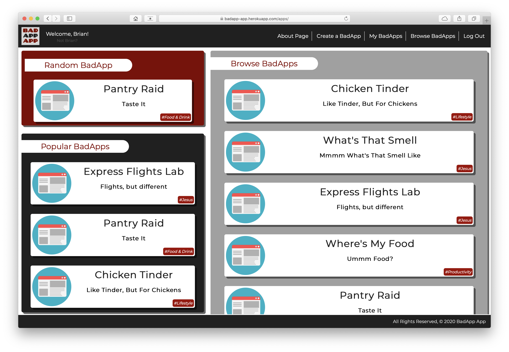
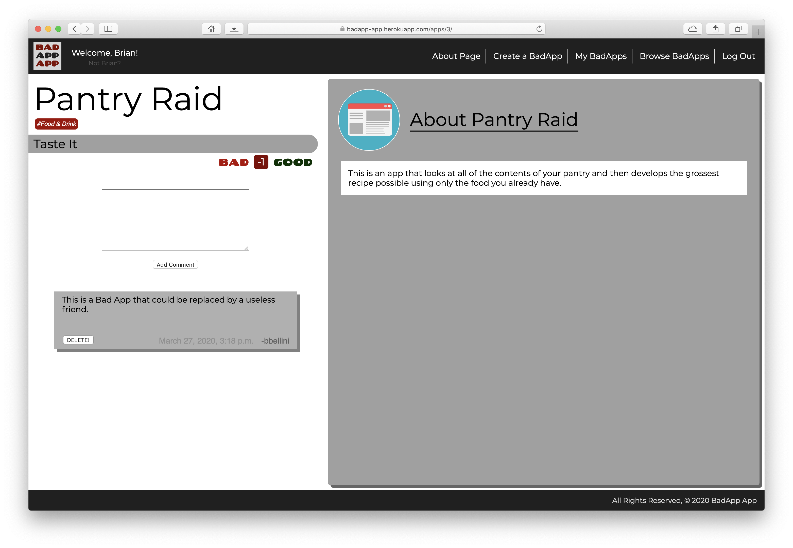
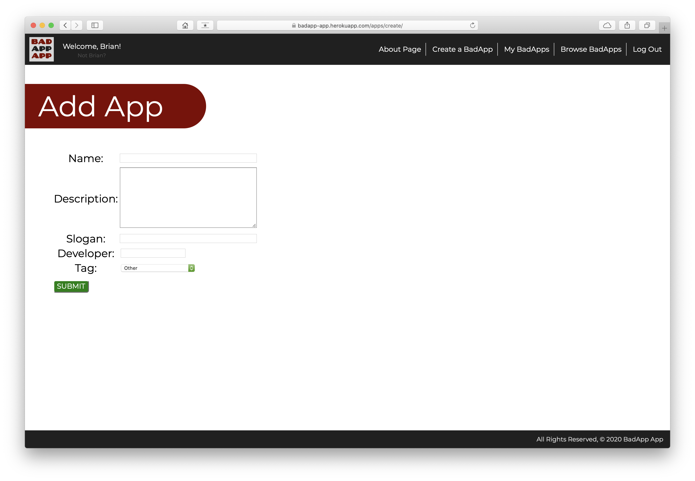

<h1>BadApp App</h1>
<h3>Project 3 - Group</h3>

<h4>Brought to you by The Best Group:</h4>

[Jacob](https://github.com/LaunchPad90)

[Cody](https://github.com/CodyLHart)

[Brian](https://github.com/brianbellini)

<h4>Technologies Used:</h4>

  	HTML
  	JavaScript
    CSS
    Django
    Amazon S3
    PostgreSQL
    Heroku

<h4>Getting Started:</h4>

[www.badappapp.com](http://www.badappapp.com)
	
[Trello Board - Planning](https://trello.com/b/9h6jCBzr/user-stories)

[Pitch-Deck](https://docs.google.com/presentation/d/1fcqI8YcUExeqlxLOi6gl843j50fqCdhSCQAcK9YTn9Y/present?usp=sharing)

<h4>Next Steps:</h4>

  * Create API for database of bad ideas for reference, becuase this will likely be useful to someone who has an idea but is unaware that it is bad.

  * If a BadApp gets too many good votes, move app to an archive of good apps, or deleted from database.

